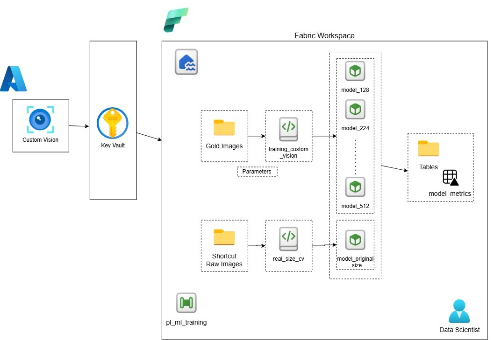
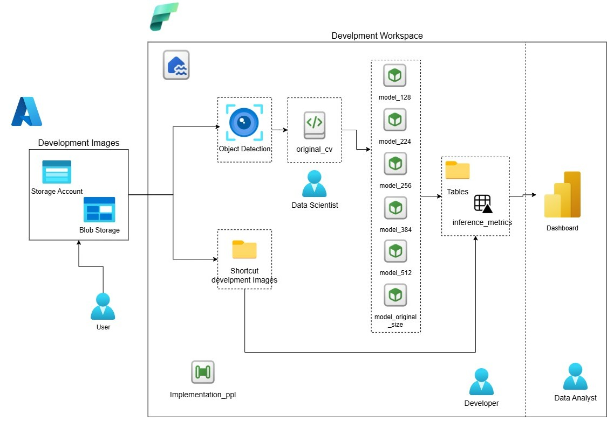

# Pet Recognition using Azure AI & Microsoft Fabric

## Overview

This project demonstrates an end-to-end Computer Vision pipeline to recognize individual pets (cats and dogs) using Azure services.

It showcases how to design, build, and operationalize an AI workflow leveraging Microsoft Fabric, Azure Blob Storage, Azure AI Vision, and Azure Custom Vision — covering the full journey from raw image ingestion to real-time pet detection and model evaluation.

---

## 🚧 Current Status

| Phase | Description | Status |
|---|---|---|
| Data Engineering | Image ingestion, resizing and dataset generation | ✅ Completed |
| Model Training | Custom Vision classification per image size (5 models) | ✅ Completed |
| Development Pipeline | Dual-provider object detection + inference (Azure + AWS) | ✅ Completed |
| Event Trigger | Blob Storage event → auto-trigger pipeline | ✅ Completed |
| Dashboard | Power BI metrics visualization | 🚧 In progress |
| Web App | External inference demo (separate repo) | 🔜 Planned |

---

## Architecture

The solution is organized into two workspaces with clearly separated roles:

### Training Workspace
Responsible for data preparation and model training.



### Development Workspace
Responsible for real-world image inference using trained models. Compares **Azure AI Vision** vs **AWS Rekognition** for object detection.



The solution follows a layered medallion architecture:

```
Azure Blob Storage (Raw Images)
        │
        │  OneLake Shortcut
        ▼
Microsoft Fabric Workspace
        │
        ├── ETL Images Pipeline
        │       ├── ForEachResizing  → image_exploring.py      → Silver layer
        │       └── ForEachGold      → dataset_builder.py      → Gold layer
        │
        ├── pl_ml_training Pipeline
        │       └── training_custom_vision.py  → pet-classifier-{size} (including original)
        │
        └── pl_implementation Pipeline
                ├── object_detection.py      → Azure AI Vision (object detection)
                ├── object_detection_aws.py  → AWS Rekognition (object detection)
                └── run_inference.py         → All classification models
                        └── inference_metrics (Delta Table) → Dashboard
```

---

## Key Features

- Scalable image preprocessing pipeline built on **Microsoft Fabric**
- Multi-resolution dataset generation (128 × 128 to 512 × 512 px)
- Automated stratified train/test split with **zero data leakage** across sizes
- Automated labeling based on folder structure — no manual tagging required
- Real-world image preprocessing using **Azure AI Vision** object detection
- Pet cropping from complex scenes (people, backgrounds) before classification
- Multi-model inference — same image evaluated against all trained models simultaneously
- Full credential management via **Azure Key Vault** — no hardcoded secrets
- Clear separation of roles: Data Engineer, Data Scientist, Developer, Data Analyst

---

## Technologies Used

| Technology | Purpose |
|---|---|
| Microsoft Fabric (Lakehouse, Notebooks, Pipelines) | Core platform — storage, compute, orchestration |
| Fabric Real-Time Hub (Eventstream + Activator) | Event-driven pipeline trigger |
| Azure Blob Storage | Raw and development image storage |
| Azure AI Vision (Computer Vision) | Pre-trained object detection — pet cropping |
| AWS Rekognition | Pet detection with reliable bounding boxes |
| Azure Custom Vision | Pet classification model training and inference |
| Azure Key Vault | Credentials management |
| PySpark | Distributed data processing and Delta table management |
| Python (Pillow) | Image resizing and cropping |
| Power BI | Metrics dashboard (in progress) |
| GitHub | Version control |

---

## Project Structure

```
pet-recognition-azure-ai/
│
├── src/
│   ├── data_engineering/
│   │   ├── image_exploring.py          ← Bronze → Silver (resize)
│   │   ├── image_standarizer.py        ← Format standardization
│   │   └── dataset_builder.py          ← Silver → Gold (train/test split)
│   ├── ml_training/
│   │   └── training_custom_vision.py   ← Train per image size
│   ├── development/
│   │   ├── object_detection.py         ← Azure AI Vision detection
│   │   ├── object_detection_aws.py     ← AWS Rekognition detection
│   │   └── run_inference.py            ← Classification inference
│   └── dashboard/
│       └── pet-recognition-theme.json  ← Power BI theme
│
├── docs/
│   ├── images/
│   ├── dashboard.md
│   ├── de_ingestion.md
│   ├── pl_implementation_design.md
│   └── training_cv.md
│
└── README.md
```

---

## Data Engineering Pipeline

The pipeline performs the following steps:

1. Reads raw images from Azure Blob Storage via **OneLake Shortcut**
2. Iterates through multiple image sizes using a **ForEach** activity
3. Resizes and standardizes images — outputs as `.jpg`
4. Applies a **stratified train/test split** (80/20) per label based on original filename — guaranteeing zero overlap across all sizes
5. Stores outputs in the Lakehouse:

```
Files/images/raw/          ← Bronze (Shortcut — read only)
Files/images/resized/      ← Silver (resized per size per label)
Files/gold/dataset_{size}/ ← Gold (train/test split per size)
```

More details in [`docs/de_ingestion.md`](docs/de_ingestion.md)

---

## Model Training

The training pipeline trains one **Azure Custom Vision** classification model per image resolution and evaluates each against a held-out test set.

**Research question:**
> Does image resolution affect model performance? Is it worth training on original-size images?

| Model | Input | Status |
|---|---|---|
| `pet-classifier-128` | 128×128 resized images | ✅ Functional |
| `pet-classifier-224` | 224×224 resized images | ✅ Functional |
| `pet-classifier-256` | 256×256 resized images | ✅ Functional |
| `pet-classifier-384` | 384×384 resized images | ✅ Functional |
| `pet-classifier-512` | 512×512 resized images | ✅ Functional |
| `pet-classifier-original` | Original resolution | � Pending execution |

Results are stored in the `model_metrics` Delta table for dashboard consumption.

More details in [`docs/training_cv.md`](docs/training_cv.md)

---

## Development Pipeline

The `pl_implementation` pipeline processes **real-world images** through two object detection providers in parallel:

1. Image is uploaded to Azure Blob Storage (`inference/` folder)
2. **Eventstream + Activator** trigger fires automatically (BlobCreated event)
3. `pl_implementation` pipeline starts with the image path
4. **Two parallel branches:**
   - `object_detection` → Azure AI Vision (heuristic-based, limited)
   - `object_detection_aws` → AWS Rekognition (reliable pet bounding boxes)
5. Each detected pet is cropped and evaluated against **all trained models** via `run_inference`
6. Results are saved to Delta tables with a `provider` column for comparison
7. Input validation rejects non-image files and logs to `pipeline_errors`

```
Files/development/
    ├── raw/                ← User uploads (via Blob Storage shortcut)
    └── cropped/
        ├── azure/          ← Crops from Azure AI Vision
        └── rekognition/    ← Crops from AWS Rekognition

Tables/
    ├── model_metrics              ← Training evaluation results
    ├── object_detection_metrics   ← Detection events (per provider)
    ├── inference_metrics          ← Classification results (per provider)
    └── pipeline_errors            ← Rejected files log
```

More details in [`docs/pl_implementation_design.md`](docs/pl_implementation_design.md)

---

## Image Resolutions

Multiple datasets are generated to evaluate the impact of resolution on model performance:

| Resolution | Use case |
|---|---|
| 128×128 | Lightweight, fast inference |
| 224×224 | Standard for many CNN architectures |
| 256×256 | Moderate detail |
| 384×384 | High detail |
| 512×512 | Maximum detail |
| Original | Baseline — no standardization |

---

## Roles

This project simulates a real-world multi-role workflow:

| Role | Responsibilities |
|---|---|
| **Data Engineer** | Builds ingestion, resizing and dataset generation pipelines |
| **Data Scientist** | Creates Azure AI Vision resource, trains and evaluates Custom Vision models |
| **Developer** | Builds `pl_implementation`, object detection and inference notebooks |
| **Data Analyst** | Connects Power BI to Lakehouse, builds inference and metrics dashboard |

More details in each pipeline doc: [`de_ingestion.md`](docs/de_ingestion.md), [`training_cv.md`](docs/training_cv.md), [`pl_implementation_design.md`](docs/pl_implementation_design.md)

---

## How to Run

### Training workflow
1. Upload raw images to Azure Blob Storage organized by label folder
2. Create a shortcut in Fabric Lakehouse pointing to the Blob container
3. Execute the **ETL Images** pipeline — confirm `size_array` is Array type
4. Validate Gold layer datasets in the Lakehouse
5. Execute the **`pl_ml_training`** pipeline — confirm Sequential mode is ON
6. Check `model_metrics` table for results

### Development workflow
1. Upload a real-world image to Azure Blob Storage (`inference/` folder)
2. The Eventstream + Activator trigger fires `pl_implementation` automatically
3. Both providers (Azure AI Vision + AWS Rekognition) detect and crop pets in parallel
4. Each crop is classified by all trained models
5. Check `inference_metrics` and `object_detection_metrics` tables for results
6. View Dashboard for visual summary

---

## Future Improvements

- Execute original size model training (add `"original"` to `size_array`)
- Power BI dashboard for inference and provider comparison
- Web app for real-time inference (separate repo, Azure Static Web Apps + Function)
- Azure AI Content Safety integration for input moderation
- CI/CD integration for automated pipeline deployment
- Confusion matrix and error analysis per model
- AI agent for querying inference metrics via natural language

---

## Author

This project is part of a personal portfolio focused on Data Engineering and AI Engineering using Azure and Microsoft Fabric.
