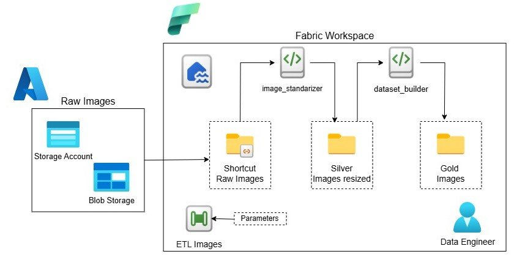

# Data Engineering Pipeline — Pet Image Classification
> **Platform:** Microsoft Fabric | **Storage:** Azure Data Lake (OneLake) | **Orchestration:** Fabric Data Pipeline

---

## Table of Contents

1. [Overview](#overview)
2. [Architecture](#architecture)
3. [Prerequisites](#prerequisites)
4. [Pipeline Parameters](#pipeline-parameters)
5. [Medallion Layers](#medallion-layers)
6. [Notebooks](#notebooks)
   - [image_exploring](#image_exploring)
   - [dataset_builder](#dataset_builder)
---

## Overview

This section implements an **end-to-end image data engineering pipeline** built natively on **Microsoft Fabric**. It ingests raw pet images from **Azure Blob Storage**, standardizes them into multiple resolutions, splits them into train/test datasets. Then, those datasets are then provided for train classification models using **Azure Custom Vision** — all orchestrated through **Fabric Data Pipelines**.

The pipeline follows the **Medallion Architecture** (Bronze → Silver → Gold), a best practice for organizing data lakes, adapted here for image data processing at scale.

---

## Architecture

The following diagram shows the processing flow:



```
Azure Blob Storage

        │  (OneLake Shortcut)
        ▼
┌─────────────────────────────────────────────────────────┐
│                  Microsoft Fabric Workspace              │
│                                                         │
│   ┌─────────────────────────────────────────────────┐   │
│   │           ETL Images Pipeline                   │   │
│   │         (Fabric Data Pipeline)                  │   │
│   │                                                 │   │
│   │   Parameters: size_array                        │   │
│   │   ["128","224","256","384","512"]                │   │
│   │                                                 │   │
│   │   ┌─────────────────────────────────────────┐   │   │
│   │   │  ForEachResizing  →  image_exploring    │   │   │
│   │   └─────────────────────────────────────────┘   │   │
│   │            │                                    │   │
│   │            ▼                                    │   │
│   │   ┌─────────────────────────────────────────┐   │   │
│   │   │  ForEachGold      →  dataset_builder    │   │   │
│   │   └─────────────────────────────────────────┘   │   │
│   └─────────────────────────────────────────────────┘   │
│                                                         │
│   ┌──────────┐   ┌──────────────┐   ┌───────────────┐  │
│   │  Bronze  │   │    Silver    │   │     Gold      │  │
│   │  (Raw)   │──▶│  (Resized)   │──▶│ (Train/Test)  │  │
│   │ Shortcut │   │   Images     │   │    Split      │  │
│   └──────────┘   └──────────────┘   └───────────────┘  │
│                                              │           │
│   ┌───────────────────────────────────────── ▼ ──────┐  │
│   │        training_custom_vision Pipeline           │  │
│   │              (Fabric Data Pipeline)              │  │
│   │   ForEach → Notebook → Azure Custom Vision       │  │
│   └──────────────────────────────────────────────────┘  │
│                                                         │
│   ┌─────────────────────────────────────────────────┐   │
│   │        model_metrics (Delta Table)              │   │
│   └─────────────────────────────────────────────────┘   │
└─────────────────────────────────────────────────────────┘
        │
        ▼

  Azure Custom Vision
  (Model Training & Publishing)
```

---

## Prerequisites

| Requirement | Details |
|---|---|
| Microsoft Fabric Workspace | With at least one attached Lakehouse (`lkh_pets`) |
| Azure Blob Storage | Containing raw pet images organized by label folders |
| Azure Custom Vision | Training and Prediction resources (S0 tier recommended) |
| Fabric Capacity | F2 or higher recommended to avoid `TooManyRequestsForCapacity` errors |
| Python Libraries | `azure-cognitiveservices-vision-customvision`, `msrest` |

---

## Pipeline Parameters

'[Fabric_pipeline](images/fabric_ppl.jpg)'

This pipeline has the parameter definition:

| Parameter | Type | Default Value | Description |
|---|---|---|---|
| `size_array` | Array | `["128","224","256","384","512"]` | Target image sizes in pixels for resizing and model training |

> ⚠️ **Important:** The parameter type must be set to **Array** in the Fabric pipeline canvas. Setting it as **String** will prevent the ForEach activity from iterating correctly.

---

## Medallion Layers

### 🥉 Bronze — Raw Images (Shortcut)
```
Files/images/raw/
    ├── gato_phil/
    │   ├── photo_001.jpg
    │   └── ...
    └── perro_serena/
        ├── photo_001.jpg
        └── ...
```
- Raw images ingested via **OneLake Shortcut** from Azure Blob Storage
- Images may include `.jpg`, `.jpeg`, `.png`, and `.heic` formats
- **Read-only** — no transformations applied at this layer

### 🥈 Silver — Resized Images
```
Files/images/resized/
    ├── gato_phil/
    │   ├── 128/
    │   ├── 224/
    │   ├── 256/
    │   ├── 384/
    │   └── 512/
    └── perro_serena/
        └── ...
```
- All images resized to target dimensions while preserving label structure
- HEIC images converted to JPEG format
- One subfolder per size per label

### 🥇 Gold — Train/Test Split
```
Files/gold/
    ├── dataset_128/
    │   ├── train/
    │   │   ├── gato_phil/
    │   │   └── perro_serena/
    │   └── test/
    │       ├── gato_phil/
    │       └── perro_serena/
    ├── dataset_224/
    └── ...
```
- Stratified 80/20 train/test split applied **per label**
- Split decision made on **original filename** to guarantee zero overlap between train and test across all sizes
- Same source images used across all sizes for fair model comparison

---

## Notebooks

### image_exploring

**Purpose:** Reads raw images from the Bronze layer and produces resized copies in the Silver layer.

**Key logic:**
- Dynamically discovers all label subfolders under `Files/images/raw/`
- Supports `.jpg`, `.jpeg`, `.png` formats
- Uses `notebookutils.fs` for all Lakehouse I/O operations
- Stages files through local `/tmp/` for PIL processing
- Outputs all images as `.jpg` regardless of input format

**Parameters received from pipeline:**

| Parameter | Description |
|---|---|
| `foreach_item` | Current image size (`"128"`, `"224"`, etc.) injected by `@item()` |

---

### dataset_builder

**Purpose:** Reads resized images from the Silver layer and produces stratified train/test splits in the Gold layer.

**Key logic:**
- Loads images using Spark `binaryFile` format
- Filters to the current size being processed
- Applies **stratified split by original filename** using Spark Window functions — ensuring every label is represented in both train and test, and no image appears in both sets
- Validates split before saving — raises an error if any label is missing from train or test

**Parameters received from pipeline:**

| Parameter | Description |
|---|---|
| `image_size` | Current image size injected by `@item()` |

---


*Built with ❤️ on Microsoft Fabric — OneLake, Spark, and Data Pipelines.*
